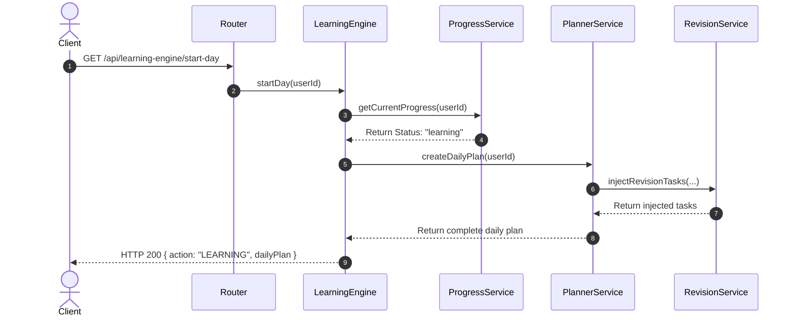

# CareerCompass System Architecture

Welcome to CareerCompass! This document outlines the high-level architectural design, structural layers, and folder layout of the backend application. It is designed to get someone completely new to the codebase up to speed in minutes.

---

## 🏗️ High-Level Design Principles

CareerCompass is built using a modular, domain-driven **Layered Architecture** adhering to the **Repository-Service Pattern**. This separates the responsibilities of network communication, business rules, database queries, and data layout.

```
       ┌────────────────────────┐
       │   Express HTTP Router  │   <-- Mounts endpoints, manages path parameters
       └───────────┬────────────┘
                   │
       ┌───────────▼────────────┐
       │    Controller Layer    │   <-- Validates user input, extracts token cookies
       └───────────┬────────────┘
                   │
       ┌───────────▼────────────┐
       │     Service Layer      │   <-- Runs business logic, scoring, and planning algorithms
       └───────────┬────────────┘
                   │
       ┌───────────▼────────────┐
       │    Repository Layer    │   <-- Abstracts database queries, uses lean projections
       └───────────┬────────────┘
                   │
       ┌───────────▼────────────┐
       │     Database Model     │   <-- Mongoose schemas and index keys
       └────────────────────────┘
```

---

## 📂 Submodule Directory Tree

All core backend domains are located under `server/modules/`. Each folder functions as a self-contained module containing its own schemas, services, and repositories:

### 1. `auth/` (Session Management)
* **What it does**: Handles user registrations, logins, token generation, blacklisting, and OTP password resets.
* **Key Files**:
  * `auth.service.js`: Controls credentials checks and issues cookies.
  * `auth.repository.js`: Interfaces with credentials tables.

### 2. `careerProfile/` (Target Profiles)
* **What it does**: Stores user career choices, target job roles, preferred companies, and daily learning hour constraints.
* **Key Files**:
  * `careerProfile.model.js`: Defines target role fields.

### 3. `daily-plan/` (Study Planner)
* **What it does**: Computes customized daily task lists fitting into user study hour budgets.
* **Key Files**:
  * `planner.service.js`: Gathers tasks and filters them by budget minutes.

### 4. `learning/` (Diagnostic & Curriculum Engine)
* **What it does**: Core orchestrator. Samples entry and final questions, scores assessments, grades metrics, and aggregates dashboard widgets.
* **Key Files**:
  * `learningEngine.service.js`: Combines user data and progress states into the unified dashboard.
  * `learningCluster.model.js`: Groupings of topics.

### 5. `progress/` (Progress State Machine)
* **What it does**: Controls cluster states and prerequisite locks. Tracks where the user left off (resume pointers).
* **Key Files**:
  * `progress.service.js`: Evaluates locks and progresses status states.

### 6. `revision/` (Spaced Repetition Spacing)
* **What it does**: Manages review tasks using the SuperMemo-2 (SM2) spaced repetition algorithm.
* **Key Files**:
  * `revision.service.js`: Schedules next review dates based on pass/fail quality.

### 7. `topic-mastery/` (Skill Mastery Metrics)
* **What it does**: Holds skill level and confidence metrics per topic.
* **Key Files**:
  * `mastery.service.js`: Runs blending math formulas to calculate weak topics.

### 8. `userTaskProgress/` (Task Status Logs)
* **What it does**: Tracks task state changes (started, in-progress, completed).

---

## 🔄 Interaction Diagram

The diagram below illustrates how submodules communicate to serve user requests:


